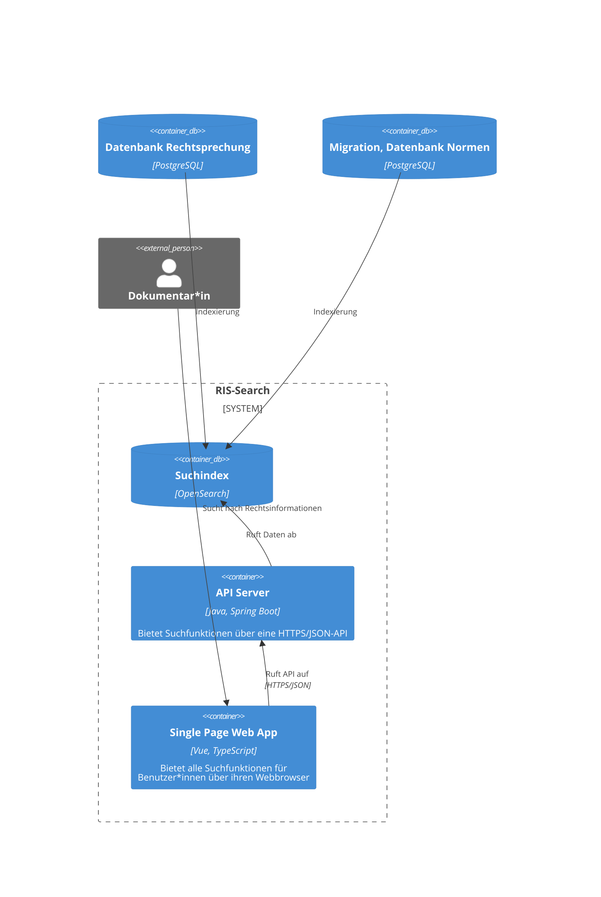

```mermaid
C4Container

      ContainerDb("db_caselaw", "Datenbank Rechtsprechung" "PostgreSQL")
      Rel("db_caselaw", "searchindex", "Indexierung")

      ContainerDb("db_norms", "Migration, Datenbank Normen", "PostgreSQL")
      Rel("db_norms", "searchindex", "Indexierung")


      System_Boundary("ris-search", "RIS-Search"){

        ContainerDb("searchindex", "Suchindex", "OpenSearch")
        Container("backend", "API Server", "Java, Spring Boot", "Bietet Suchfunktionen über eine HTTPS/JSON-API")
        Container("frontend", "Single Page Web App", "Vue, TypeScript", "Bietet alle Suchfunktionen für <br>Benutzer*innen über ihren Webbrowser")

        Rel("backend", "searchindex", "Ruft Daten ab")
        Rel("frontend", "backend", "Ruft API auf", "HTTPS/JSON")
        Rel("documentalist", "frontend", "Sucht nach Rechtsinformationen")
      }

      Person_Ext("documentalist", "Dokumentar*in")
```
