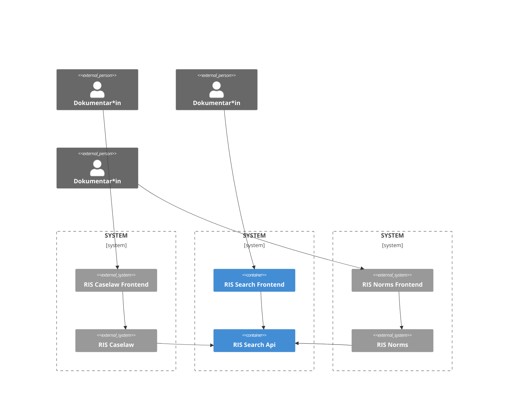

```mermaid
C4Container

    Person_Ext("documentalist1", "Dokumentar*in")
    Person_Ext("documentalist3", "Dokumentar*in")
    Person_Ext("documentalist2", "Dokumentar*in")

    System_Boundary("caselaw") {
        System_Ext("ris-caselaw-fe", "RIS Caselaw Frontend")
        System_Ext("ris-caselaw", "RIS Caselaw")
    }

    System_Boundary("search") {
        Container("ris-search-fe", "RIS Search Frontend")
        Container("ris-search-api", "RIS Search Api")
    }

    System_Boundary("norms") {
        System_Ext("ris-norms-fe", "RIS Norms Frontend")
        System_Ext("ris-norms", "RIS Norms")
    }


Rel("documentalist1", "ris-caselaw-fe", "")
Rel("ris-caselaw-fe", "ris-caselaw", "")
Rel("ris-caselaw", "ris-search-api", "")

Rel("documentalist2", "ris-norms-fe", "")
Rel("ris-norms-fe", "ris-norms", "")
Rel("ris-norms", "ris-search-api", "")


Rel("documentalist3", "ris-search-fe", "")
Rel("ris-search-fe", "ris-search-api", "")

UpdateLayoutConfig($c4ShapeInRow="3", $c4BoundaryInRow="3")

```
